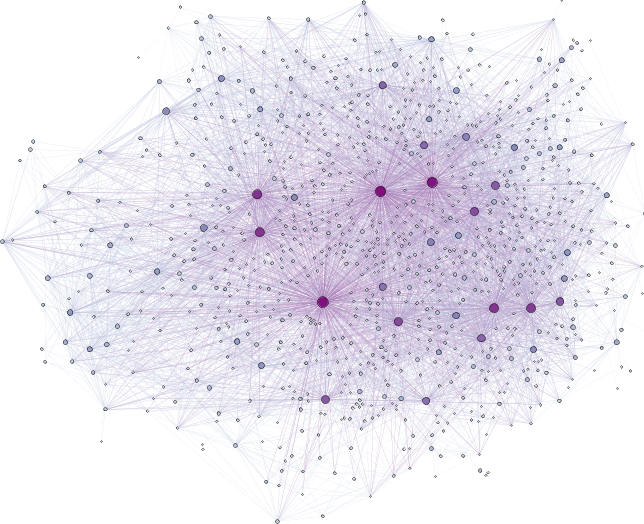

Status: [][travis]


Graph of Hackage packages
=========================

Inspired by the recent release of [cabal-db][cabal-db], I wondered what Hackage
might look like on a larger scale.

Hackage currently (April 2014) consists of around 6000 nodes (packages) with
36000 edges (dependencies). Only the dependencies of the latest version of each
package are taken into account. Ignoring packages with two or less dependencies
and `base`, here is what it looks like:



A higher resolution that includes package names image is available in the
[`out`](out/) directory (18 MiB PNG), as well as the raw [`dot`][dot] file to
create it.

Since there are *lots* of dependencies going all over the place, the graph
is mostly a giant blob. To extract useful information from it probably requires
special focus in an appropriate program.


Usage
-----

The rather hacky program reads the locally stored package database
`00-index.tar` from a hardcoded location (in [`Main.hs`][main]), and generates
data in [`dot`][dot] format to represent all packages and which packages they
depend on. The result is written to STDOUT, ready to be plotted with GraphViz
compatible tools such as [Gephi][gephi].

To build and run from scratch, proceed as usual:
```
cabal sandbox init && cabal install --only-dependencies
cabal run -v0 > output.dot
```


[cabal-db]: http://hackage.haskell.org/package/cabal-db
[dot]:      https://en.wikipedia.org/wiki/DOT_%28graph_description_language%29
[gephi]:    https://gephi.org/
[travis]:   https://travis-ci.org/quchen/hackage-graph
[main]:     src/Main.hs